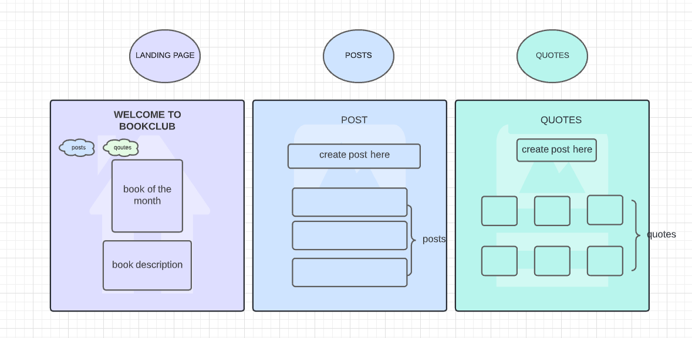

# Frontend Capstone Project for Book Club application

I enjoy reading 📖 and discussing with others thoughts on recent reads. With the pandemic I though maybe this application can be for other introverts as well who also enjoy reading with a cup of coffee ☕ and posting book quotes and reviews. This repo contains the frontend Angular applciation communicates with the <a href="https://github.com/yaretzyc/backend-capstoneproject" target="_blank">Backend Spring Boot Application</a>.

#### CONTENTS
- [User Stories](#USER-STORIES)
- [Wireframes](#WIREFRAMES)
- [Project Challenges](#CHALLENGES)
- [Future Improvements](#FUTURE-IMPROVEMENTS)

## USER STORIES
| | 
|:---|
|1.	As a user, I would like to view the book of the month.
|2.	As a user, I would like to see a navagation bar to the post and quote pages.
|3.	As a user, I would like to click on a button to create a post.
|4.	As a user, I would like to click on a button to create a quote.
|5.	As a user, I would like to see an archive of previous months' book.
|6.	As a user, I would like to edit my post.
|7.	As a user, I would like to edit my quote.
|8. As a user, I would like to see a list of other people's post.
|9. As a user, I would like to see a list of quotes in card format.

## WIREFRAMES
### LUCIDCHART

   

## CHALLENGES
  <ul>
  <li>Cors Issue</li>
  <li>Getting 404 errors in console Not Found</li>
  <li>Deployment to heruko</li>

</ul>
  
## FUTURE IMPROVEMENTS
   Design of webpage, navigation bar, and not delay deployment of website.
  
   -wed: project planning, user stories, backend Erd,
   -thur: Spring boot modules, postman test apis, create angular app components
   -fri:  cors config(backend),environments baseurlapi, quote list, quote create, quote service, approuting, logo, CURRETNLY: LANDING PAGE AND DESIGN 
   
